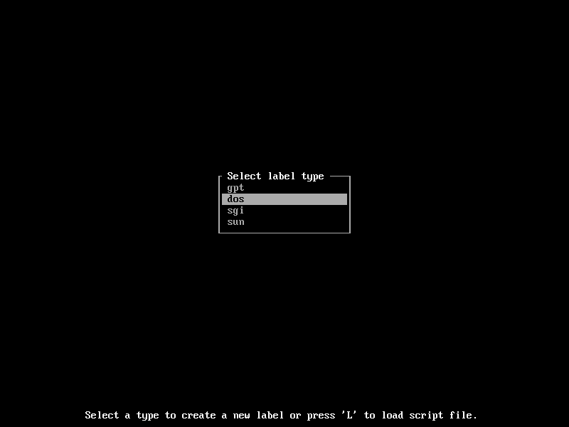
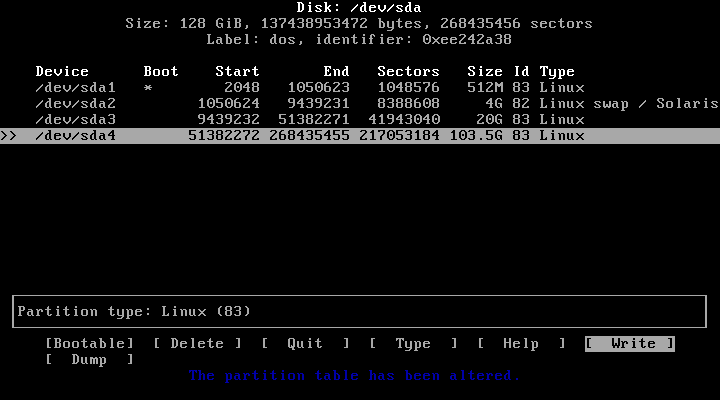

   * [Annexe dédiée à 'installation d'Arch Linux sur une machine dépourvue d'UEFI](#annexe-dédiée-à-l-installation-d-arch-linux-sur-une-machine-dépourvue-d-uefi)
      * [I) Partitionnement et attribution des partitions en mode Bios :](#i-partitionnement-et-attribution-des-partitions-en-mode-bios)<br>
      * [II) Installation de GRUB en mode BIOS](#ii-installation-de-grub-en-mode-bios)


Annexe dédiée à l'installation d'Arch Linux sur une machine dépourvue d'UEFI
========================================================================================


I) Partitionnement et attribution des partitions en mode Bios :
----------------------------------------------------------------------

Pour le partitionnement, si vous avez peur de faire des bêtises, il est plus prudent de passer par un LiveCD comme gParted disponible à l’adresse suivante : <http://gparted.org/>

Avec cfdisk, sur l’écran de démarrage suivant, on choisit l’option « dos » pour le « label type » à appliquer.



*Premier démarrage de cfdisk*

Pour le partitionnement en question :

| Référence |  Point de montage |  Taille                           |   Système de fichiers |
|-----------|-------------------|-----------------------------------|-----------------------|
| /dev/sda1 | /boot             | 512 Mo                            |  ext4                 |
| /dev/sda2 |                   | Taille de la mémoire vive ou plus – à partir de 8 Go de mémoire vive, 1 Go est conseillé |  swap                 |
| /dev/sda3 |  /                | 20 Go minimum                     |  ext4                 |
| /dev/sda4 | /home             | Le reste du disque                | ext4                  |
  

Il ne faut pas oublier de définir la partition attribuée à /boot comme démarrable (bootable). Ce qui donne l’écran suivant dans cfdisk.



*cfdisk en action*

Pour le formatage des partitions, il suffit d’entrer les commandes suivantes :

```
mkfs.ext4 /dev/sda1
mkfs.ext4 /dev/sda3
mkfs.ext4 /dev/sda4
```

Sans oublier la partition de swap :

```
mkswap /dev/sda2
swapon /dev/sda2
```

On va ensuite créer les points de montage et y associer les partitions qui correspondent.

```
mount /dev/sda3 /mnt
mkdir /mnt/{boot,home}
mount /dev/sda1 /mnt/boot
mount /dev/sda4 /mnt/home
```

On peut passer ensuite à l’installation de la base.

II) Installation de GRUB en mode BIOS
----------------------------------------------

En BIOS, comme en UEFI, j'utilise Grub2 qui s’occupe de tout et récupère les paquets qui vont bien. Le paquet os-prober est indispensable pour un double démarrage.

Pour installer GRUB en mode BIOS :

```
pacman -Syy grub os-prober
grub-install --no-floppy --recheck /dev/sda
```

**Note :** Après avoir généré l'image noyau et installé grub, il faut passer au fichier de configuration du lanceur. C'est une modification intervenue avec grub 2:2.02-8 :

```
grub-mkconfig -o /boot/grub/grub.cfg
```

Le reste de l'installation est commune avec l'installation en UEFI.