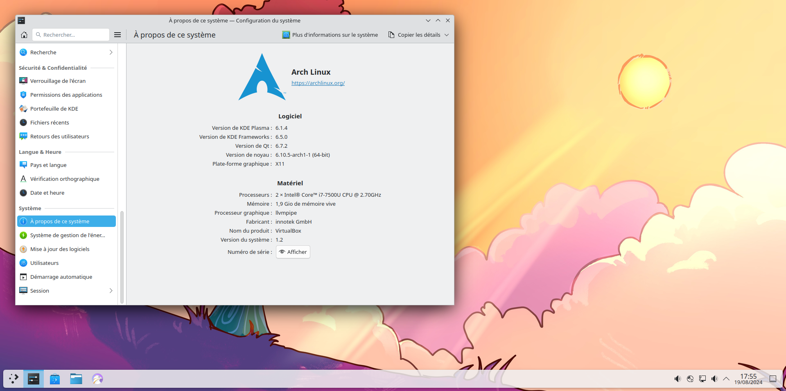
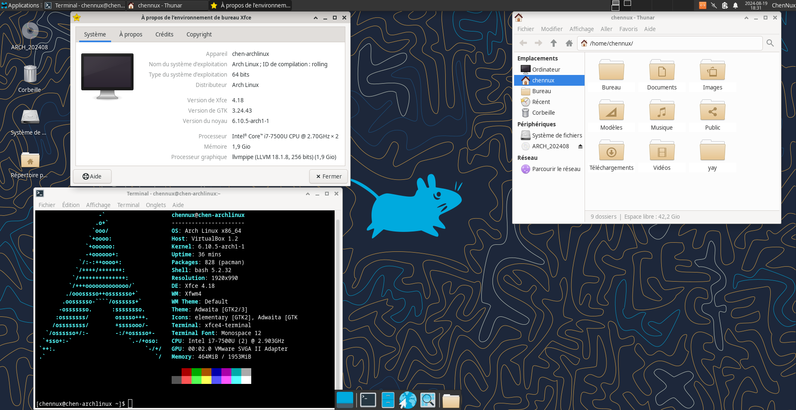
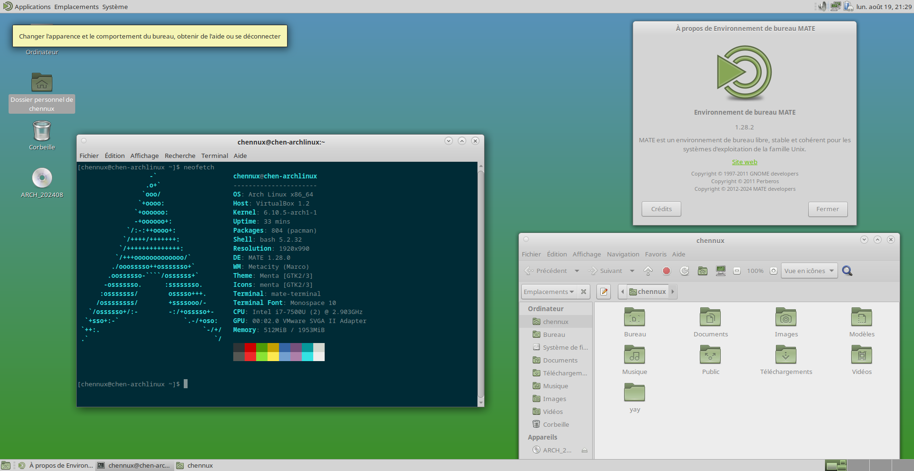

Sommaire
========

   * [Petit guide d’installation d’Archlinux avec Gnome / Plasma / Xfce / Mate-Desktop / Cinnamon / LXQt](#petit-guide-dinstallation-darchlinux-avec-gnome--plasma--xfce--mate-desktop--cinnamon--lxqt)
      * [I) Installons notre base](#i-installons-notre-base)<br>
      * [II) Commençons l'installation de l’environnement graphique !](#ii-commen%C3%A7ons-linstallation-de-lenvironnement-graphique-)
      * [III) Installons l'environnement de bureau.](#iii-installons-lenvironnement-de-bureau)<br>
            * [a) Installons GNOME](#a-installons-gnome)<br>
            * [b) Installons KDE Plasma](#b-installons-kde-plasma)<br>
            * [c) Installons Xfce, Mate ou Cinnamon](#c-installons-xfce-mate-ou-cinnamon)<br>
            * [d) Installons LXQt](#d-installons-lxqt)<br>

Créé par [gh-md-toc](https://github.com/ekalinin/github-markdown-toc)


Petit guide d’installation d’Archlinux avec GNOME / Plasma / Xfce / Mate-Desktop / Cinnamon / LXQt
=======================================================================================================================

Dans ce petit guide, je vais détailler l’installation d’Archlinux avec GNOME, Plasma, Xfce,  Mate-Desktop, Cinnamon et LXQt. L’installation terminée proposera un environnement suffisamment étoffé pour être utilisable.

Pour des raisons pratiques, je n’aborde nullement l’ajout de matériel comme les imprimantes, les scanners, ou encore les webcams. Je vous renvoie aux wikis anglophone <https://wiki.archlinux.org/> et francophone <http://wiki.archlinux.fr/Accueil> pour ce genre de manipulations.

**NOTE :** Ce tutoriel est **volontairement simplifié**. Il va vous permettre de voir comment installer une ArchLinux **en solo**. Ensuite, s’il y a **des spécificités liées à votre matériel, c’est au cas par cas qu’il faut regarder et compulser frénétiquement les wikis ci-dessus.** Si vous voulez installer une Archlinux **en parallèle** d’une installation de MS-Windows, c’est en dehors du cadre de ce document.

Merci à Ewolnux, Xarkam, Frédéric Sierra, Ludovic Riand, Vincent Manillier, Thomas Pawlowski, Igor Milhit, André Ray, Nicolas, Charles Monzat, SuperMario S, Angristan, Simon B, r33int, Mozzi, Kevin Dubrulle, Christophe Leloup, Nornort et Quentin Bihet pour leurs conseils et remarques. Et merci surtout à Frédéric Béziès pour avoir rédigé les premières versions de ce document, proposé sous licence [CC-BY-SA 4.0.](http://creativecommons.org/licenses/by-sa/4.0)

I) Installons notre base
------------------------

Installer une Archlinux, c’est comme construire une maison. On commence par les fondations, et on rajoute les murs et le reste par la suite. L’image ISO utilisée est la archlinux-2021.07.01-x86\_64.iso, mise en ligne début juillet 2021.

La machine virtuelle est une machine virtuelle à laquelle j’ai rajouté un disque virtuel de 50 Go. Des points spécifiques concernant l’utilisation dans VirtualBox et VMWare sont indiqués.

**Note :** Désormais, par souci de clarté, seuleb l'installation en UEFI sera traitée dans cette nouvelle version du tutoriel. Si vous installez Arch Linux dans une machine virtuelle, pensez donc bien à l'activer dans ses paramètres. Si vous ne disposez cependant pas d'UEFI, je vous invite à lire les instructions de paritionnements et d'installation du chargeur d'amorçarge dans [l'annexe dédiée.](annexe-bios.md)

La première chose à faire, c’est d’avoir le clavier français :

```
loadkeys fr
```

On s'occupe de vérifier que la connexion Internet est fonctionnelle :
```
ping google.fr
```
**Note :** si vous souhaitez utiliser une connexion WiFi, un serveur proxy ou SSH pour réaliser l'installation, je vous invite à lire [l'annexe didée à la configuration du réseau](annexe-reseau.md).

Si tout est fonctionnel, nous pouvons passer au partitionnement. Voici donc l’écran qui nous permet de démarrer en mode UEFI :


*Démarrage en mode UEFI*

Pour le partitionnement, si vous avez peur de faire des bêtises, il est plus prudent de passer par un LiveCD comme gParted disponible à l’adresse suivante : <http://gparted.org/>

Il faut se souvenir qu’il faut **obligatoirement** une table de partition GPT en cas d’installation en mode UEFI. Si vous n’êtes pas passé par gParted, il faut utiliser l’outil cgdisk.

| Référence | Point de montage |  Taille                                                                                   | Système de fichiers  |
| --------- | ---------------- |-----------------------------------------------------------------------------------------  | -------------------- |
| /dev/sda1 | /boot/efi        | 128 Mo                                                                                    |  fat32               |
| /dev/sda2 | /                | 20 Go minimum                                                                             |  btrfs               |
| /dev/sda3 |                  | Taille de la mémoire vive ou plus – à partir de 8 Go de mémoire vive, 1 Go est conseillé |  swap                |
| /dev/sda4 | /home            | Le reste du disque                                                                        |  btrfs               |
  

**Note :** pour la partition /boot/efi, il faut qu’elle soit étiquetée en EF00 à sa création. Pour le swap, c’est la référence 8200.


*cgdisk en action pour un partitionnement avec un UEFI*

Le partitionnement à appliquer ? C’est le suivant :

```
mkfs.fat -F32 /dev/sda1
mkfs.btrfs /dev/sda2
mkfs.btrfs /dev/sda4
```

Sans oublier la partition de swap :

```
mkswap /dev/sda3
swapon /dev/sda3
```

Et pour les points de montage :

```
mount -o compress=zstd /dev/sda2 /mnt
mkdir /mnt/{boot,boot/efi,home}
mount /dev/sda1 /mnt/boot/efi
mount -o compress=zstd /dev/sda4 /mnt/home
```

**Note :** L'option `-o compress=zstd` permet de compresser les partitions BTRFS avec l'algorithme zstd, ce qui permet de gagner en espace disque mais aussi en durée de vie, particulièrement pour les SSD.

On peut passer à l’installation de la base.

Après avoir procédé au partitionnement et à l’attribution des partitions, on peut attaquer les choses sérieuses, à savoir récupérer la base de notre installation. mais avant toute chose, choisissons le miroir le plus rapide.


Avec l'outil Reflector, nous allons générer une liste des miroirs de téléchargement des paquets, en fonction de votre localisation. Je vais utiliser personnellement ces paramètres :

```
reflector -c FR -c GB -p https -a 12 --sort rate --save /etc/pacman.d/mirrorlist
```
Autrement dit, nous allons utiliser uniquement des miroirs français et britanniques (paramètres que vous pourrez changer selon votre emplacement), utilisant le protocole https et mis à jour dans les 12 dernières heures. Nous les classons dans le même temps par rapidité et les enregistrons dans le fichier */etc/pacman.d/mirrorlist*.


On passe à l’installation de la base. La deuxième ligne rajoute certains outils bien pratiques à avoir dès le départ. On peut ensuite s’attaquer à l’installation proprement dite.

```
pacstrap /mnt base linux linux-firmware base-devel pacman-contrib man-{db,pages,pages-fr} texinfo btrfs-progs 
pacstrap /mnt zip unzip p7zip nano mc alsa-utils syslog-ng mtools dosfstools lsb-release ntfs-3g exfat-utils bash-completion
```
Si on veut utiliser un noyau linux long terme, il faut remplacer sur la première ligne pacstrap le paquet linux par linux-lts. Pour ntfs-3g, c’est utile si vous êtes amené à utiliser des disques formatés en ntfs. Si ce n’est pas le cas, vous pouvez l’ignorer allègrement.

**Note :** exfat-utils m’a été conseillé par André Ray pour la prise en charge des cartes SD de grande capacité. Merci pour le retour !

Vous pouvez également remplacer nano par vim si vous préférez ce dernier.

Si vous êtes sur un pc portable, l’ajout de tlp est conseillé pour améliorer l’autonomie de la batterie. Plus d’info sur cette page : <https://wiki.archlinux.org/index.php/TLP>

Si vous désirez rajouter le support des microcodes pour votre processeur, il vous suffira de rajouter soit le paquet amd-ucode (pour AMD) ou intel-ucode (pour Intel). Grub détectera leur présence automatiquement.

Maintenant que les outils de base sont installés, il faut générer le fichier /etc/fstab qui liste les partitions présentes.

```
genfstab -U /mnt >> /mnt/etc/fstab
```

On passe aux réglages de l’OS qu’on vient d’installer. Il faut donc y entrer. On utilise la commande suivante :

```
arch-chroot /mnt
```

Avant d’aller plus loin, voici quelques infos pratiques. Cela concerne les pays francophones comme la France, la Belgique, la Suisse, le Luxembourg ou encore le Canada francophone.

Nous allons par la suite créer des fichiers qui demanderont des valeurs précises. Les voici résumées ici :

  
| Pays       | Locale (LANG) | Clavier (KEYMAP) |
|------------|---------------|------------------|
| Belgique   |  fr\_BE.UTF-8 |  be-latin1       |
| Canada     |  fr\_CA.UTF-8 |  cf              |
| France     |  fr\_FR.UTF-8 |  fr-latin9       |
| Luxembourg |  fr\_LU.UTF-8 |  fr-latin9       |
| Suisse     |  fr\_CH.UTF-8 |  fr\_CH-latin1   |
  

Pour avoir le bon clavier en mode texte, créez le fichier /etc/vconsole.conf. Il suffira de l’adapter si le besoin s’en fait sentir.

```
KEYMAP=fr-latin9
FONT=eurlatgr
```

Pour avoir la localisation française, le fichier /etc/locale.conf doit contenir la bonne valeur pour LANG. Pour une personne en France métropolitaine :

```
LANG=fr_FR.UTF-8
LC_COLLATE=C
```

**Note :** La deuxième ligne est nécessaire si on apprécie d’avoir le tri par la « casse » (majuscule puis minuscule) activé. Merci à Igor Milhit pour la remarque !

Il faut vérifier que la ligne fr\_FR.UTF-8 UTF-8 dans le fichier /etc/locale.gen n’a pas de \# devant elle. Ainsi que la ligne en\_US.UTF-8 UTF-8. Évidemment, la valeur fr\_FR.UTF-8 doit être modifiée si besoin est. On va maintenant générer les traductions :

```
locale-gen
```

On peut spécifier la locale pour la session courante, à modifier en fonction de votre pays :

```
export LANG=fr_FR.UTF-8
```

Le nom de la machine ? Il est contenu dans le fichier **/etc/hostname**. Il suffit de taper le nom sur la première ligne. Par exemple : *chen-archlinux.* À remplacer par le nom de la machine bien entendu.

Le fuseau horaire ? Une seule étape. Prenons le cas d’une installation avec le fuseau horaire de Paris. Tout dépend de votre lieu de résidence. On commence par créer un lien symbolique :

```
ln -sf /usr/share/zoneinfo/Europe/Paris /etc/localtime
```

Ensuite, deux cas se présentent. Soit on a une machine en mono-démarrage sur Archlinux, et on peut demander à ce que l’heure appliquée soit UTC, soit un double démarrage avec MS-Windows. Restons dans ce premier cas.

```
hwclock --systohc --utc
```

**Sinon, on ne touche à rien.** MS-Windows est un goujat dans ce domaine.

Étape suivante ? Générer l'image du noyau.

```
mkinitcpio -p linux (ou **linux-lts** si vous voulez le noyau lts.)
```

**Note** : si vous avez une « hurlante » contenant « /run/lvm/lvmetad.socket: connect failed » ou quelque chose d’approchant, ce n’est pas un bug. C’est une alerte sans conséquence. Cf <https://wiki.archlinux.org/index.php/GRUB#Boot_freezes>


*Génération du noyau linux 5.12.14 début juillet 2021*	


Au tour du chargeur de démarrage. J’utilise Grub2 qui s’occupe de tout et récupère les paquets qui vont bien. Le paquet os-prober est indispensable pour un double démarrage.


La deuxième ligne permet de vérifier un point de montage et de l’activer au besoin. La troisième installe Grub. Merci à Kevin Dubrulle pour l’ajout.

```
pacman -Syy grub os-prober efibootmgr
mount | grep efivars &> /dev/null || mount -t efivarfs efivarfs /sys/firmware/efi/efivars
grub-install --target=x86_64-efi --efi-directory=/boot/efi --bootloader-id=arch_grub --recheck
```

De plus, pour éviter tout problème de démarrage par la suite, spécialement dans VirtualBox, il est conseillé de rajouter les commandes suivantes :

```
mkdir /boot/efi/EFI/boot
cp /boot/efi/EFI/arch_grub/grubx64.efi /boot/efi/EFI/boot/bootx64.efi
```

**Note :** Après avoir généré l'image noyau et installé grub, il faut passer au fichier de configuration du lanceur. C'est une modification intervenue avec grub 2:2.02-8.

```
grub-mkconfig -o /boot/grub/grub.cfg
```

**Note 2** :Simon B m'a fait remarqué qu'en cas de double démarrage avec une autre distribution GNU/Linux déjà installée, il n'est pas indispensable d'installer de bootloader sous Archlinux. Il suffit de faire une commande comme update-grub dans la distribution installée en parallèle d'Archlinux.

Bien entendu, aucune erreur ne doit apparaître. On donne un mot de passe au compte root :

```
passwd
```

Pour le réseau, installer et activer NetworkManager est une bonne idée. Vous pouvez l'installer comme ceci :
```
pacman -S networkmanager
systemctl enable NetworkManager
```

Si vous voulez utiliser le bluetooth :
```
pacman -S bluez
systemctl enable bluetooth
```

**NOTE 1 :** si vous n’utilisez pas NetworkManager, je vous renvoie à cette page du wiki anglophone d'Archlinux, qui vous aidera dans cette tâche : <https://wiki.archlinux.org/index.php/Netctl>. Il vous faut alors installer le paquet netctl.

**NOTE 2 :** netctl et networkmanager rentrent en conflit et **ne doivent pas** être utilisé en même temps. Une règle simple : un seul gestionnaire de connexion réseau à la fois !

**NOTE 3 :** si vous voulez utiliser des réseaux wifi directement avec NetworkManager et son applet, le paquet gnome-keyring est indispensable. Merci à Vincent Manillier pour l’info.

Si vous voulez utiliser un outil comme Wine ou Steam (qui est nécessitent des librairies 32 bits), il faut décommenter (enlever les \#) des lignes suivantes dans /etc/pacman.conf :

```
#[multilib]
#Include = /etc/pacman.d/mirrorlist
```

**NOTE 4** (d'après une suggestion de **Lomig**) : Toujours dans le pacman.conf, vous pouvez décommenter ou rajouter ces options dans la partie "#Misc options" pour rendre Pacman plus sympathique :

```
UseSyslog
Color
CheckSpace
VerbosePkgLists
ParallelDownloads = 5
ILoveCandy
ParallelDownloads = 5
```

On peut maintenant quitter tout, démonter proprement les partitions et redémarrer.
C’est un peu plus délicat qu’auparavant. Au moins, on voit les étapes à suivre.

```
exit
umount -R /mnt
reboot
```

Voilà, on peut redémarrer. **Il faut éjecter le support d’installation pour éviter des problèmes au démarrage suivant.** On va passer à la suite, largement moins ennuyeuse !

II) Commençons l'installation de l'environnement graphique !
------------------------------------------------------------

Nous attaquons donc la partie la plus intéressante, l’installation de l’environnement graphique. Il y a des étapes communes à tous les environnements. 

Une fois le système démarré, on se connecte **en root**. Étant donné que j’ai installé NetworkManager à l’étape précédente, le réseau fonctionne directement. J’ajoute ntp (synchronisation de l’heure en ligne) et cronie (pour les tâches d’administration à automatiser). 

```
pacman -Syu ntp cronie
```

**Note :** si on veut avoir les logs en clair en cas de problème, il faut modifier avec nano (ou vim) le fichier /etc/systemd/journald.conf en remplaçant la ligne :

```
#ForwardToSyslog=no
```

par :

```
ForwardToSyslog=yes
```

Les outils en place, on lance alsamixer avec la commande du même nom, pour configurer le niveau sonore :


*alsamixer en action*

Une fois l’ensemble configuré, pour le conserver tel quel, il suffit d’entrer :

```
alsactl store
```

Nous sommes dans le multimédia ? Restons-y.

On va installer l’ensemble des greffons gstreamer qui nous donneront accès aux fichiers multimédias une fois Gnome lancé. Il faudra remplacer **pacman -S** par **sudo pacman -S** quand vous utiliserez votre compte utilisateur « normal » plus tard.

Merci à Adrien de Linuxtricks pour m’avoir aidé à réduire la longueur de la ligne de commande :)

```
pacman -S gst-plugins-{base,good,bad,ugly} gst-libav
```

gst-libav ? Il prend en charge tout ce qui est x264 et apparenté.

Passons à l’installation de Xorg. Le paquet xf86-input-evdev est obsolète depuis début mars 2017, à cause du passage à xorg-server 1.19. Les paquets xf86-input-mouse et xf86-input-keyboard n'existent plus depuis la purge de Xorg en décembre 2019.

**Note :** il n’y a pas d’espace entre le – et le { vers la fin de la commande suivante.

```
pacman -S xorg-{server,xinit,apps} xdg-user-dirs
```

Si on utilise un ordinateur portable avec un pavé tactile, il faut rajouter le paquet xf86-input-synaptics ou **de préférence** xf86-input-libinput.

Il faut ensuite choisir le pilote pour le circuit vidéo. Voici les principaux pilotes, sachant que le paquet xf86-video-vesa englobe une énorme partie des circuits graphiques, dont ceux non listés dans le tableau un peu plus loin. En cas de doute : <https://wiki.archlinux.org/index.php/Xorg#Driver_installation>

Pour Nvidia, c’est un casse-tête au niveau des pilotes propriétaires. Le plus simple est de se référer au wiki d'Archlinux : <https://wiki.archlinux.org/index.php/NVIDIA>. Et si vous avez la technologie Optimus : <https://wiki.archlinux.org/index.php/NVIDIA_Optimus>

**Note 2** : Il est recommandé dans la plupart des cas de n'installer aucun pilote pour les cartes graphiques Intel : cf. <https://wiki.archlinux.org/index.php/Intel_graphics#Installation>

 
| Circuits graphiques | Pilotes libres         | Pilotes non libres (si existant)                     |
|---------------------|------------------------|------------------------------------------------------|
| AMD                 | xf86-video-ati         |                                                      |
|                     | xf86-video-amdgpu      | AMDGPU-PRO (cf. le wiki d'Arch Linux)                |
| Intel               | ⚠ xf86-video-intel     |                                                      |
| Nvidia              | xf86-video-nouveau     | Nvidia (cf. le wiki d'Arch Linux) pour la version à installer en fonction de la carte graphique |
| VMWare / VirtualBox | xf86-video-vmware      |                                                      |
| Universel           | xf86-video-vesa        |                                                      |

Si vous faites une installation dans VirtualBox, il faut deux paquets : les additions invités, et les modules noyaux nécessaires à leur fonctionnement.

Ce qui donne :

```
pacman -S virtualbox-guest-utils
```


La prise en charge des modules noyau se fait avec la commande systemctl suivante :

```
systemctl enable --now vboxservice
```

Dans le cas où vous utilisez VMWare, vous devez installer aussi les VMWare Tools :
```
pacman -S xf86-video-vmware open-vm-tools
``` 

De la même façon, vous devez activer les services adéquats :
```
systemctl enable --now {vmtoolsd,vmware-vmblock-fuse}.service
```

**Note 3 :** si vous installez un jour VirtualBox sur une machine réelle je vous renvoie à cette page du wiki francophone : <https://wiki.archlinux.fr/VirtualBox>

**Note 4** : pour installer VMWare sur une machine réelle cette page du wiki anglophone est très utile : <https://wiki.archlinux.org/index.php/VMware>

On passe ensuite à l’installation des polices. Voici la ligne de commande pour les principales. Le paquet freetype2 apportant quelques améliorations. Merci à Angristan pour la suggestion.
Les polices noto servent, quant à elles, à supporter la majorité des caractères Unicode (émojis, caractères asiatiques, symoboles mathématiques...).

```
pacman -S ttf-{bitstream-vera,liberation,dejavu,carlito,caladea} gnu-free-fonts freetype2 noto-fonts{,-extra,-cjk,-emoji}
```

**Note 5 :** pour les polices Microsoft, le paquet ttf-ms-fonts, elles sont sur le dépôt AUR, donc il faut utiliser un enrobeur comme yay pour les récupérer et les installer.

On va rajouter quelques outils, histoire de ne pas voir un environnement vide au premier démarrage.

On installe le service d'impression CUPS et le maximum de pilotes pour l'imprimante. `python-pyqt5` est une dépendance pour l'interface de configuration d'`hplip` (qui n'est utile que pour une imprimante HP ou Brother récente). Pour être tranquille avec son imprimante :

```
pacman -S cups hplip python-pyqt5 foomatic-db{,-ppds,-gutenprint-ppds,-nonfree,-nonfree-ppds} gutenprint
```

Nous allons maintenant installer plusieurs logiciels utiles au quotidien : Firefox pour le navigateur web (avec l'indispensable bloqueur de publicités), LibreOffice pour la suite bureautique (avec le correcteur orthographique Hunspell), GIMP pour la retouche photo et xsane pour la numérisation :

```
pacman -S firefox-{i18n-fr,ublock-origin} libreoffice-still-fr hunspell-fr gimp gimp-help-fr xsane
```
De nombreux autres logiciels sont bien sûr également disponibles dans les dépôts d'ArchLinux.

Ensuite, on crée un utilisateur classique avec les commandes suivantes :

```
useradd -m -g wheel -c 'Nom complet de l’utilisateur' -s /bin/bash nom-de-l’utilisateur
passwd nom-de-l’utilisateur
```

Avant de finir, on va configurer sudo en utilisant visudo qui modifie /etc/sudoers. En effet, il nous suffit de modifier une ligne pour que l’on puisse accéder en tant qu’utilisateur classique aux droits complets sur la machine de manière temporaire.

Pensez à préciser l'éditeur que vous voulez utiliser en exécutant la commande. Par exemple :
```
EDITOR="nano" visudo
```

Il faut aller, en utilisant la flèche du bas jusqu’à la ligne :

```
#Uncomment to allow members of group wheel to execute any command
```
Et enlever le \# sur la ligne qui suit.

**Petit bonus : installer Yay pour compléter Pacman.**

Pour rappel, Yay est un enrobeur de pacman, qui permet de profiter de toutes les fonctionnalités de celui-ci tout en simplifiant la gestion des loigiciels en provenance du dépôt AUR.

**Note 6 : actions à effectuer en tant qu'utilisateur classique**

L'installation en utilisateur simple ? 

```
sudo pacman -S git
git clone https://aur.archlinux.org/yay
cd yay
makepkg -sri
```

Pour être certain d’avoir le bon clavier au démarrage de GDM, de SDDM ou de LightDM (selon votre environnement de bureau), voici une petite commande à lancer (en modifiant le clavier selon les besoins) :

```
sudo localectl set-x11-keymap fr
```

Les valeurs étant à adapter en fonction de la locale et du clavier, bien entendu.


Étant donné que systemd est utilisé, voici la liste des services à activer (avec une explication rapide), **qui sera la même pour chacun des environnements** proposés :

```
sudo -i
systemctl enable syslog-ng@default → *gestion des fichiers d’enregistrement d’activité*
systemctl enable cronie → *pour les tâches récurrentes*
systemctl enable avahi-{daemon,dnsconfd} → *dépendances de Cups*
systemctl enable cups → *cups pour les imprimantes*
systemctl enable ntpd → *pour synchroniser l’heure en réseau.*
systemctl enable systemd-oomd → *tue automatiquement les processus trop gourmands*
systemctl enable fstrim.timer → *optimisations pour les SSD (inutile sur les HDD)*
exit
```

III) Installons l'environnement de bureau
-----------------------------------------

**Note :** à partir de maintenant, nous sommes connectés en tant qu’utilisateur classique.

#### a) Installons GNOME

**Note :** commandes à entrer en tant qu’utilisateur classique. Vous pouvez utiliser un enrobeur de pacman comme yay par exemple.

On commence par installer les paquets de GNOME. Le paquet telepathy permet d’ajouter le maximum de support pour les comptes utilisateurs en ligne. Gnome Logiciels (alias gnome-software) est désormais installé avec le méta-paquet gnome. Le paquet gnome-software-packagekit-plugin permet d'installer des logiciels provenant des dépôts d'Arch Linux depuis Gnome Logiciels.
unoconv sert à disposer des aperçus des documents dans GNOME Documents.

```
sudo pacman -S gnome gnome-extra gnome-software-packagekit-plugin system-config-printer telepathy shotwell rhythmbox unoconv
```

Si vous voulez ajouter le support du MTP (appareils sous Android par exemple), installez en plus le paquet mtpfs.
L’installation de Gnome est maintenant terminée.

Ensuite, on lance GDM :
```
sudo systemctl start gdm.service
```

Si tout se passe bien : on l'active au démarrage.
```
sudo systemctl enable gdm.service
```

Il faut penser à vérifier que le clavier est correctement configuré. Ce qui se fait dans menu système unifié, paramètres.

Pour finir une capture d’écran du mode « Gnome Shell ».


*Gnome Shell 40*

#### b) Installons KDE Plasma


**Note :** commandes à entrer en tant qu’utilisateur classique. Vous pouvez utiliser un enrobeur de pacman comme yay par exemple.

Pour Discover, packagekit-qt5 est indispensable. La libappindicator-gtk{2,3} permet de mieux supporter les notifications des applications GTK+.

L’installation se déroule ainsi :

```
sudo pacman -S plasma kde-applications digikam packagekit-qt5 libappindicator-gtk{2,3}
```

On lance ensuite sddm :

```
sudo systemctl start sddm
```

Si tout se passe bien, on peut utiliser pour l'activer:

```
sudo systemctl enable sddm
```



*Illustration 14: Plasma 5.22.3*

#### c) Installons Xfce, Mate ou Cinnamon 

Par souci de simplicité, j'ai décidé de regrouper dans un même pargraphe ces 3 environnements dont le processus d'installation est assez proche.

**Note :** commandes à entrer en tant qu’utilisateur classique. Vous pouvez utiliser un enrobeur de pacman comme yay par exemple.

**Note 2 :** si vous avez besoin de gérer des périphériques utilisant MTP (tablettes sous android par exemple), il vous faut rajouter les deux paquets gvfs-mtp et mtpfs.
Si vous voulez la totalité des greffons gvfs (merci à SuperMarioS pour la ligne de commande) :
```
sudo pacman -S gvfs-{afc,goa,google,gphoto2,mtp,nfs,smb}
```

La première ligne ici est propre à l'environnement que vous voulez installer.

Pour installer Xfce, il faut entrer :

```
sudo pacman -S xfce4 xfce4-goodies gvfs quodlibet python-pyinotify lightdm-gtk-greeter xarchiver claws-mail galculator evince ffmpegthumbnailer pavucontrol pulseaudio-{alsa,bluetooth} network-manager-applet system-config-printer **→ (pour installer le support des imprimantes)**
```

Pour Mate :

```
sudo pacman -S mate mate-extra lightdm-gtk-greeter gnome-icon-theme vlc quodlibet python-pyinotify accountsservice claws-mail ffmpegthumbnailer pulseaudio-{alsa,bluetooth} blueman network-manager-applet system-config-printer
```

Enfin, pour Cinnamon :

```
sudo pacman -S cinnamon cinnamon-translations gnome-{terminal,screenshot,calculator,extra} eog evince file-roller gedit lightdm-gtk-greeter shotwell rhythmbox system-config-printer
```

Comme vous pouvez le remarquer, l'installation de ces 3 environnements est complétée par divers logiciels types, comme quodlibet (et sa dépendance python-pyniotify) pour la musique ou claws-mail comme client mail.

Si vous voulez personnaliser votre lightdm :

```
sudo pacman -S lightdm-gtk-greeter-settings
```

Pour lancer l'environnement, il faut entrer dans un premier temps :

```
sudo systemctl start accounts-daemon --> *uniquement si vous utilisez Mate*
sudo systemctl start lightdm
```

Et si tout se passe bien, on peut utiliser :

```
sudo systemctl enable accounts-daemon --> *uniquement si vous utilisez Mate*
sudo systemctl enable lightdm
```



*Xfce 4.16 en action.*



*Mate Desktop 1.24.1*


*Cinnamon 5.0.5*

#### d) Installons LXQt

Dans cette nouvelle version du tutoriel, j'ai décidé de ne garder que l'environnement LXQt, qui supplante progressivement LXDE.

**Note** : commandes à entrer en tant qu’utilisateur classique. Vous pouvez utiliser un enrobeur de pacman comme yay par exemple.

**Note 2** : Si vous avez besoin de gérer des périphériques utilisant MTP (tablettes sous android par exemple), il vous faut rajouter les deux paquets gvfs-mtp et mtpfs. Si vous voulez la totalité des greffons gvfs (merci à SuperMarioS pour la ligne de commande) :

```
sudo pacman -S gvfs-{afc,goa,google,gphoto2,mtp,nfs,smb}
```

Comme pour l’installation de Xfce ou encore de Mate Desktop, j’ai pris quelques logiciels types. Libre à vous de remplacer Claws-mail par Mozilla Thunderbird par exemple.

Xterm est installé, car il est indispensable pour faire fonctionner l’appliquette de gestion du niveau du son.

Pour installer LXQt :
```
sudo pacman -S lxqt breeze-icons sddm vlc xarchiver xscreensaver qmmp libstatgrab lm_sensors xcursor-themes claws-mail pavucontrol pulseaudio-alsa notepadqq qpdfview xterm network-manager-applet pavucontr system-config-printer → (pour installer le support des imprimantes)
```

Pour lancer LXQt, il faut entrer dans un premier temps :

```
sudo systemctl start sddm
```

Si tout se passe bien, on peut utiliser :

```
sudo systemctl enable sddm
```


*LXQt 0.17*

Voila, le guide est maintenant fini. Cependant, je n’ai pas abordé l’installation d’un pare-feu. C’est quelque chose de plus technique.

J’ai surtout voulu faire un **guide rapide**, histoire de montrer qu’en une petite heure on pouvait avoir un environnement installé et assez complet pour le fignoler par la suite.

Bonne découverte !
